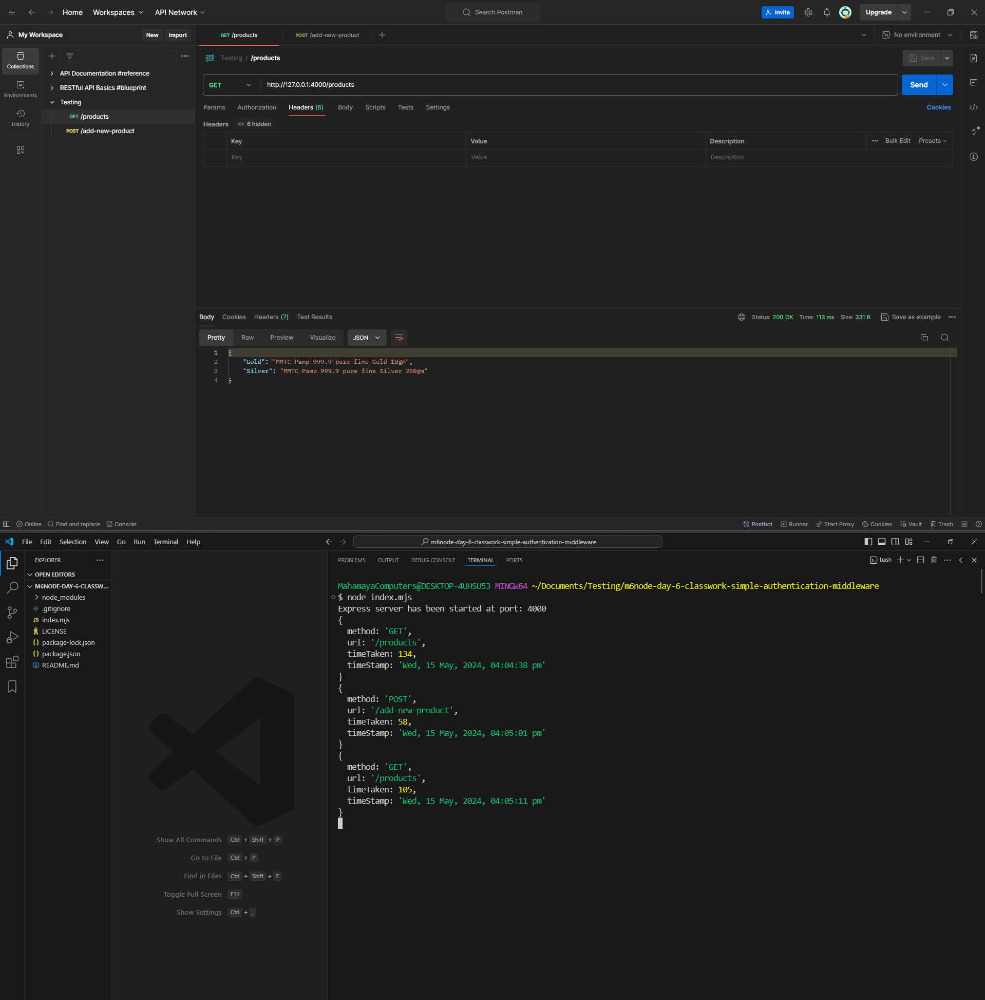

# Simple Authentication Middleware (Day 6 Classwork, Module #6, MERN Stack)


## Overview : 
Logging middleware is a software component that sits between the client and server in a web application, intercepting incoming requests and outgoing responses to log relevant information. It captures details such as request headers, parameters, payloads, response status codes, and timestamps. This middleware helps developers monitor and debug their applications by providing visibility into request-response cycles, error logging, performance metrics, and security events. It typically integrates with logging frameworks to record this information in log files or send it to logging services for analysis.

## Task :
Created a logging middleware for my Express application. This middleware should log information about each incoming request, including:
+ the HTTP method,
+ the requested URL, and 
+ the timestamp
+ Additionally, log the time taken for processing the request.  


## How to install and run in yours local machine
```bash
npm install
npm run start
```

## API End Point #1
```javascript
GET /add-new-product
```
When a GET request is made to route ```/add-new-product```, the server will respond with a dummy message ```product added!```

### API Response Example
```javascript
product added !
```

## API End Point #2
```javascript
POST /products
```
When a GET request is made to route ```/products```, the server will respond with a json data with sample products.

### API Response Example
```javascript
{
    "Gold": "MMTC Pamp 999.9 pure fine Gold 10gm",
    "Silver": "MMTC Pamp 999.9 pure fine Silver 250gm"
}
```

## Tech. Stack Used:
+ [NodeJS](https://nodejs.org/en/)
+ [ExpressJS](https://expressjs.com/)

## Author
[Abhishek kumar](https://www.linkedin.com/in/alex21c/), ([Geekster](https://geekster.in/) MERN Stack FS-14 Batch)


